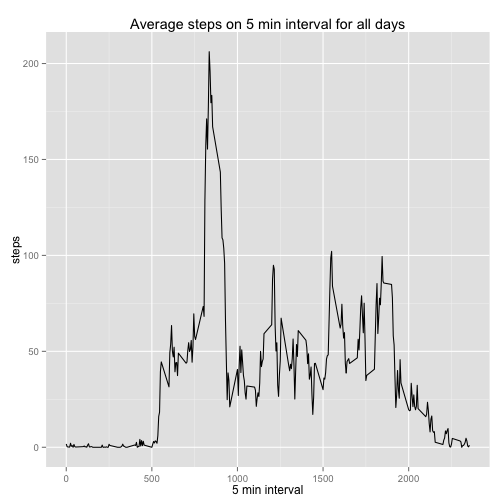
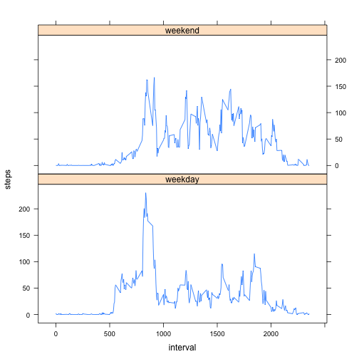

## Introduction


This document analyse the human activity during period of two months time preiod. Data is provided in *activity.csv* file.

## Data
Dataset includes folowing valiables.

* **steps** : Number of steps taking in a 5-minute interval (missing values are coded as NA)
* **date** : The date on which the measurement was taken in YYYY-MM-DD format
* **interval** : Identifier for the 5-minute interval in which measurement was taken


```r
activity = read.csv("activity.csv")
activity$date = as.Date(activity$date)
summary(activity)
```

```
##      steps            date               interval   
##  Min.   :  0.0   Min.   :2012-10-01   Min.   :   0  
##  1st Qu.:  0.0   1st Qu.:2012-10-16   1st Qu.: 589  
##  Median :  0.0   Median :2012-10-31   Median :1178  
##  Mean   : 37.4   Mean   :2012-10-31   Mean   :1178  
##  3rd Qu.: 12.0   3rd Qu.:2012-11-15   3rd Qu.:1766  
##  Max.   :806.0   Max.   :2012-11-30   Max.   :2355  
##  NA's   :2304
```


## Analysis of activity on per day basis

This section analyse data on per day basis, calculating total steps taken and generating frequency chart for same.

```r
dates = factor(activity$date)
stepsum = tapply(activity$steps, dates, function(x) sum(x, na.rm=any(!is.na(x))))
hist(stepsum, main="Histogram of total steps each day", xlab="Steps")
```

 

Mean  and meadian of total number of steps observed during course of this study  10766 and 10765 respectively.

## Average daily pattern on 5 min interval

This section activity is analysed on test subject on each 5 min interval time period of each day for whole period of observation.


```r
steps5min <- activity %>%
    group_by(interval) %>%
    summarise_each(funs(mean(., na.rm=TRUE)), steps)

qplot(interval, steps, data=steps5min, geom="line", xlab="5 min interval",
      main="Average steps on 5 min interval for all days")
```

 

During the time interval of 835 maximum activity is observed.

## Effect of missing values

This data set have 2304 **NA** or missing values, to study further the effect of missing values, in this section we create new data frame with missing values filled with average of 5 min interval across days.


```r
names(steps5min)[2] <- "avgsteps"
newactivity = activity
newactivity <- merge(newactivity, steps5min, by="interval")
newactivity = newactivity[order(newactivity$date,newactivity$interval),]
newactivity$steps = ifelse(is.na(newactivity$steps), as.integer(newactivity$avgsteps),
                           newactivity$steps)

dates = factor(newactivity$date)
newstepsum = tapply(newactivity$steps, dates, function(x) sum(x, na.rm=any(!is.na(x))))
hist(newstepsum, main="Histogram of total steps each day", xlab="Steps")
```

 

Mean of 10749 and median 10641 are observed with this new data set. Comparing histogram of previous and new dataset depicts changes in frequency of total number of steps taken.

## Effect of weekdays 
This section will focus on study of activity based on the days if it belongs to weekday or weeken, and generate comparision chart between those.


```r
newactivity <- transform(newactivity, 
                         day=weekdays(newactivity$date) %in% c("Sunday", "Saturday"))
newactivity$day <- factor(newactivity$day)
levels(newactivity$day) <- c("weekday", "weekend")

weekdaystep5min = newactivity %>%
     group_by(interval, day) %>%
     summarise_each(funs(mean(.,na.rm=TRUE)), steps)
xyplot(weekdaystep5min$steps ~ weekdaystep5min$interval | weekdaystep5min$day, 
       layout=c(1,2), xlab="interval", ylab="steps", type="l")
```

 
